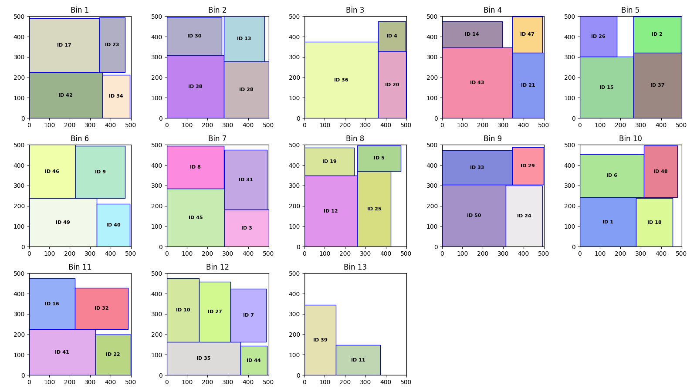
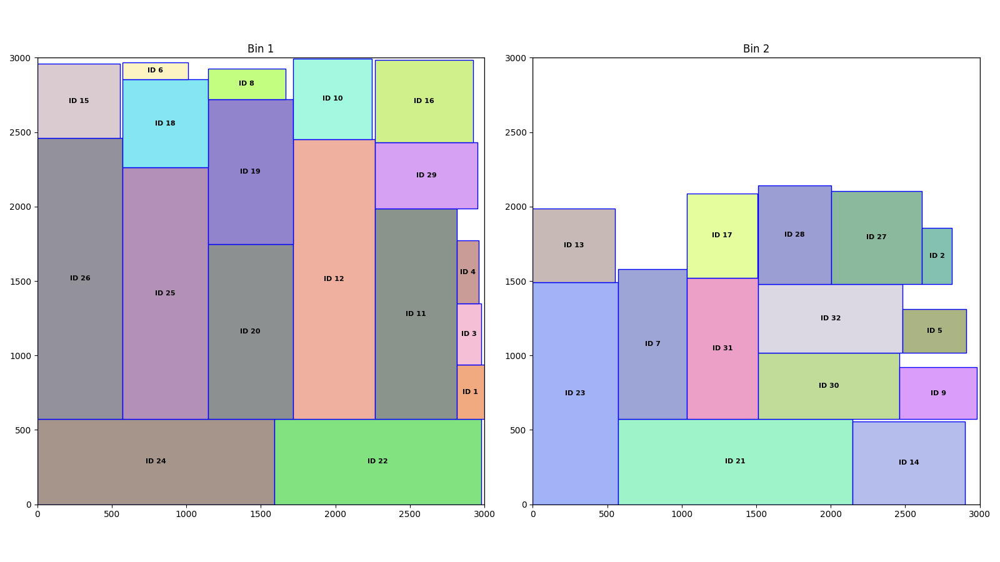

# 2D Bin Packing Problem

The 2D Bin Packing Problem involves efficiently packing a set of rectangular items into a limited number of fixed-size bins while optimizing certain criteria, such as maximizing space utilization or minimizing the number of bins used.

In this project, We propose a hybrid evolutionary algorithm for solving the 2D bin packing problem in which the items can be rotated and must follow the guillotine cut property.

## Versions of the 2D Bin Packing Problem

The 2D Bin Packing Problem can be categorized based on whether the items can be rotated and whether the items must adhere to the guillotine cut property. Each version addresses different constraints:

- **Rotation (0 or R)**:
  - When rotation is not allowed (0), items must be placed in their original orientation.
  - When rotation is allowed (R), items can be rotated to better fit within the bin, which can lead to higher space utilization.

- **Guillotine Cut Property (F or G)**:
  - Guillotine free (F) allows for more flexibility in item placement as cuts don't need to be considered.
  - Guillotine cut property (G) requires that items be placed in a manner that allows for them to be separated from the bin using a series of edge-to-edge cuts. This mimics real-world cutting processes and often adds complexity to the problem.

By considering these variations, we can tackle different scenarios of the 2D Bin Packing Problem:

- **2DBP | 0 | F**: Simplest form where items are placed in their original orientation without the need for guillotine cuts.
- **2DBP | 0 | G**: Items must be placed in their original orientation and follow the guillotine cut property.
- **2DBP | R | F**: Items can be rotated, offering flexibility, without needing to follow the guillotine cut property.
- **2DBP | R | G**: Most complex form where items can be rotated and must follow the guillotine cut property.

## Implementation

We implemented a **Hybrid Genetic Algorithm** proposed in the paper *"A Hybrid Genetic Algorithm for the 2D Guillotine Cutting Problem"* ([original paper](https://www.sciencedirect.com/science/article/pii/S1877050913003980?ref=pdf_download&fr=RR-2&rr=886d22872d9e189c)), to which we added new features to handle rotation and the guillotine cut property, as well as mutations.

To tackle the most complex version, **2DBP | R | G** (Rotated and Guillotine Cut Property), we implemented our solution in **Python** using **Numba** to optimize performance.

### Optimizing with Numba

**Numba** is a **Just-In-Time (JIT)** compiler for Python that translates a subset of Python and NumPy code into **fast machine code**. This significantly **improves the performance of numerical computations**. It allows developers to write code in Python while achieving performance close to that of lower-level languages.

To further enhance performance, we use **Numba's caching technique**, which **avoids recompilation** at every execution by storing the compiled machine code. This means that the first time a function runs, Numba compiles and caches it, and subsequent executions retrieve the compiled code from the cache, **reducing overhead and improving runtime efficiency**.

## How to Launch

First, ensure all the required packages are installed by executing this command: `pip install -r requirements.txt`

To run the program, go to `main.py` and unselect the parts of the code based on your needs:

1. **Compile Code**: Select this to compile all necessary functions using Numba. 
   - You can set the `advanced` flag to **True** to get more insights into the compilation time of each function.
2. **Generate Solutions**: Select this to run the genetic algorithm on each input file.
3. **Visualize Solutions**: Select this to visualize the solution of a specific packing scenario.

## Results

Here are examples of solutions generated by the genetic algorithm for the **2DBP | R | G** scenario (items can be rotated and must follow the guillotine cut property):

*Example Solution 8: Items are packed using rotations and guillotine cuts to maximize space utilization.*

*Example Solution 13: Another scenario showing efficient packing with rotations and guillotine cuts.*

These examples illustrate how our hybrid genetic algorithm effectively optimizes space utilization and adheres to the guillotine cut property.

