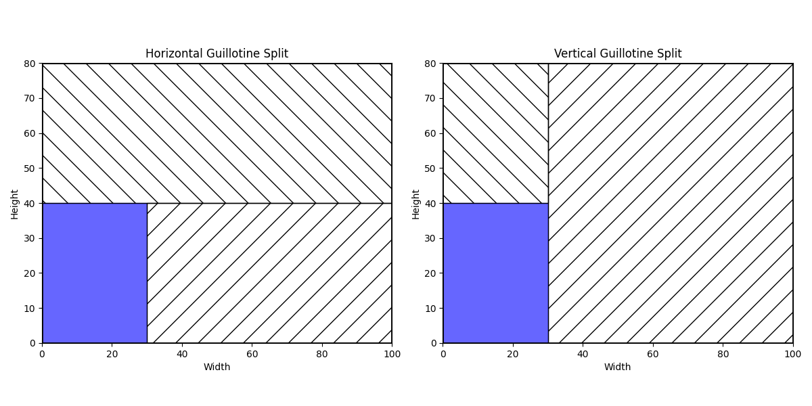

# 2D Bin Packing Problem

The 2D Bin Packing Problem involves efficiently packing a set of rectangular items into a limited number of fixed-size bins while optimizing certain criteria, such as maximizing space utilization or minimizing the number of bins used.

In this project, We propose a **Hybrid Evolutionary Algorithm** and a **Tabu Search Algorithm** for solving the 2D bin packing problem in which the items can be rotated and must follow the guillotine cut property.

## How to Launch

First, ensure all the required packages are installed by executing this command: `pip install -r requirements.txt`

To run the program, go to `main.py` and unselect the parts of the code based on your needs:

1. **Compile Code**: Select this to compile all necessary functions using Numba. 
   - You can set the `advanced` flag to **True** to get more insights into the compilation time of each function.
2. **Generate ALl Solutions**: Select this to generate the solution of every file in the input folder.
3. **Generate Single Solutions**: Select this to generate the solution of a single file.
4. **Visualize Solutions**: Select this to visualize the solution of a specific packing scenario.

At the top of `main.py` you can tweak the parameters.

**Parameters for Genetic Algorithm**

- `POPULATION_SIZE`: Determines the number of individuals (solutions) in each generation of the genetic algorithm.

- `NB_GENERATIONS`: Specifies the number of generations (iterations) that the genetic algorithm will run.

- `CROSSOVER_RATE`: Represents the proportion of the new generation that is created through crossover.

- `MUTATION_RATE`: Indicates the likelihood that a mutation will occur in an individual.

- `DELTA`: Controls the diversity in the crossover. Lower values encourage higher diversity among parent selection. 
  - Must be $\ge 1$

**Parameters for the Unified Tabu Search**

- `ITERATION_NUMBER`: Specifies the maximum number of iterations (or moves) that the Tabu Search Algorithm will execute.

- `TABU_LIST_SIZE`: Sets the size of the tabu list.

**Shared Genetic and Tabu Search Parameters**

- `KAPPA`: Controls the degree to which the initial population of solutions favors items based on their area ranking in the deterministic input sequence. Lower values encourage higher diversity among solutions.
  - Must be $\ge 1$

**General Options**

- `GUILLOTINE`: Boolean flag indicating whether guillotine cuts are included.

- `ROTATION`: Boolean flag indicating whether rotating an items is allowed.

- `SELECTED_METAHEURISTIC`: Specifies the metaheuristic selected for optimization.

## Versions of the 2D Bin Packing Problem

The 2D Bin Packing Problem can be categorized based on whether the items can be rotated and whether the items must adhere to the guillotine cut property. Each version addresses different constraints:

- **Rotation (0 or R)**:
  - When rotation is not allowed (0), items must be placed in their original orientation.
  - When rotation is allowed (R), items can be rotated to better fit within the bin, which can lead to higher space utilization.

- **Guillotine Cut Property (F or G)**:
  - Guillotine free (F) allows for more flexibility in item placement as cuts don't need to be considered.
  - Guillotine cut property (G) requires that items be placed in a manner that allows for them to be separated from the bin using a series of edge-to-edge cuts. This mimics real-world cutting processes and often adds complexity to the problem.

By considering these variations, we can tackle different scenarios of the 2D Bin Packing Problem:

- **2DBP | 0 | F**: Simplest form where items are placed in their original orientation without the need for guillotine cuts.
- **2DBP | 0 | G**: Items must be placed in their original orientation and follow the guillotine cut property.
- **2DBP | R | F**: Items can be rotated, offering flexibility, without needing to follow the guillotine cut property.
- **2DBP | R | G**: Most complex form where items can be rotated and must follow the guillotine cut property.

## Implementation

### Problem Context

Traditional methods represent solutions as static configurations of bins with assigned items. However, it becomes computationally expensive when we to compute all the neighbors, which are the possible moves from one solution to another. Each move involves checking all possible spaces where each item can potentially fit into another bin while ensuring that these moves adhere to the guillotine rule.

### Rethinking Solution Representation

To address this problem, we redefined how solutions are represented. Instead of fixed assignments of items to bins, solutions are now represented as ordered sequences or permutations of items. This permutation-based approach serves as input to a heuristic algorithm responsible for dynamically constructing the bin configuration.

This transformation simplifies the computation of neighbors to essentially rearranging the order of items in the sequence. Each rearrangement represents a potential new solution configuration. Compared to traditional methods where each move would require checking multiple bins and ensuring guillotine rules are followed, the permutation-based approach focuses solely on rearranging the item order. This significantly reduces computational complexity and speeds up the process of exploring alternative solutions.

### Packing Heuristic

We use the **Improved Lowest Gap Fill (LGFI)** Heuristic to pack items into bins. This algorithm is designed to minimize wasted areas. Here’s how it works: 

**Input**: LGFI takes an ordered sequence of items as input. This sequence determines the order in which items will be considered for placement.

1. **Identifying the Current Position**: The bottom-leftmost position in the bin where an item may be placed is identified as the `current position`.

2. **Determining the Current Gap**:

   - *Horizontal Gap*: This is the distance between the current position and either the right border of the bin or the left edge of the first item encountered between the current position and the bin's right border.
   - *Vertical Gap*: This is the distance between the current position and the upper border of the bin. 

    The current gap is defined as the smaller of the horizontal and vertical gaps. It represents the immediate space available for placing the next item.

3. **Item Placement Strategy**: 
   - The algorithm attempts to place the first item from the list that can completely fill the current gap.
   - If no perfect fit exists, the first item that fits without overlapping others is placed.
   - If neither condition is met, a wastage area is declared.

4. **Opening New Bins**: If no suitable current position is found for placing an item, and there are still unpacked items left, a new bin is opened to continue the packing process.

### Guillotine Rule

To manage guillotine cuts, our approach involves representing a bin as a `collection of placed items` with specific coordinates and a `list of free spaces` that divide the utilized area of the bin into distinct free rectangles. The borders of these free rectangles ensure that items cannot violate the guillotine rule.

When an item is placed within a free rectangle, `the algorithm creates two new free rectangles by splitting the original free rectangle` around the newly placed item. This splitting process can occur either horizontally or vertically, starting from the top-right corner of the placed item.

**But then,  How is the splitting direction decided ?**

We Implemented `3 differents methods` to determine the direction of the cut:

Let $Wr$ and $Hr$ denote the *Width* and *Height* of the free rectangle where the item was placed.\
Let $Wi$ and $Hi$ denote the *Width* and *Height* of the item.

1. **Shorter Leftover** : cut is Horizontal if $Wr−Wi < Hr−Hi$, and Vertical otherwise.
2. **Min Area** : cut is Horizontal if $Hi\times(Wr−Wi ) < Wi\times(Hr−Hi )$, and Hertical otherwise.
3. **Custom Hybrid Fit** :\
   Let $N$ denote the number of newly created free rectangle where at least one unpacked item can fit ($0$, $1$ or $2$).\
   Let $F$ denote the maximum fill percentage achieved by an unpacked item when placed into a free rectangle.
   - cut is Horizontal if $N_{horizontal} < N_{vertical}$
   - cut is Vertical if $N_{vertical} < N_{horizontal}$
   - If they are equal :
     - cut is Horizontal if $F_{horizontal} > F_{vertical}$
     - cut is Vertical if $F_{horizontal} \le F_{vertical}$

We had to create a custom function because the existing methods[^1] did not yield satisfactory results. It was evident that in certain bins, the placement could be optimized. The Custom **Hybrid Fit** method was developed to `maximize the use of available space` by considering not only the dimensions of the newly created spaces but also `their ability to accommodate remaining items`, ensuring a more optimal utilization of the bin's total volume.

### Fitness Function

The fitness function is formulated to address the dual objectives of reducing the number of bins and maximizing the space utilization within the last bin. The fitness $F$ is based on the number of bins $Nbins$ and the average squared wasted space in all bins except the last one. This aims to gradually remove items from the last bin until it is completely emptied.

Let $F_{i}$ denote the percentage fill the the $i^{th}$ bin in the solution.

$$ Fitness = Nbins​ + \left(\frac{1}{Nbins - 1​}\sum_{i = 1}^{Nbins - 1} (1 - F_{i})^{2}\right) $$

Both the **Hybrid Evolutionary Algorithm** and the **Tabu Search Algorithm** are designed to **minimize** this fitness function.

### Hybrid Genetic Algorithm

We implemented the **Hybrid Genetic Algorithm** proposed in the paper *"A Hybrid Genetic Algorithm for the 2D Guillotine Cutting Problem"*[^2] ([original paper](https://www.sciencedirect.com/science/article/pii/S1877050913003980?ref=pdf_download&fr=RR-2&rr=886d22872d9e189c)), to which we added new features to handle rotation and the guillotine cut property, as well as mutations.

### Tabu Search Algorithm

We also implemented a classic **Tabu Search Algorithm** with 3 kinds of neighbourhood :
- **rotations :** rotate 1 item ($n$ neighbours)
- **permutations :** swap 2 side-by-side items ($n-1$ neighbours)
- **insertions :** insert 1 item to the first position and shift the others to the right to fill the gap ($n-1$ neighbours)

### Optimizing with Numba

**Numba** is a **Just-In-Time (JIT)** compiler for Python that translates a subset of Python and NumPy code into **fast machine code**. This significantly **improves the performance of numerical computations**. It allows developers to write code in Python while achieving performance close to that of lower-level languages. Numba also allows for easy parallelization of `for` loops.

To further enhance performance, we use **Numba's caching technique**, which **avoids recompilation** at every execution by storing the compiled machine code. This means that the first time a function runs, Numba compiles and caches it, and subsequent executions retrieve the compiled code from the cache, **reducing overhead and improving runtime efficiency**.

**Exemple**:
We timed the execution of the Genetic Algorithm with 50 items to pack, both with and without Numba optimizations (*CPU : i7-7700K*):
  - Without Numba : `123.6 seconds`
  - With Numba : `0.4 seconds` :laughing: (compilation + `for` loops parallelization)

## Results

Here are examples of solutions generated by the genetic algorithm for the **2DBP | R | G** scenario (items can be rotated and must follow the guillotine cut property):

*Example Solution 8: Items are packed using rotations and guillotine cuts to maximize space utilization.*

*Example Solution 13: Another scenario showing efficient packing with rotations and guillotine cuts.*

These examples illustrate how our hybrid genetic algorithm effectively optimizes space utilization and adheres to the guillotine cut property.

### Best Results

Considering a set of items and a particular size of bin, if with assume that it is possible to perfectly fit all the items into bins, the minimal number of bin will be :

$$ minimalBinNumber = \left\lceil\frac{\sum itemArea}{binArea}\right\rceil $$

For our dataset, here are the results and the theoretical minimal number of bins according to the formula : 
|File Name|Theoretical Result| Actual Result |
|----------------------|--------|-------|
| binpacking2d-01.bp2d | 3      |4      |
| binpacking2d-02.bp2d | 5      |6      |
| binpacking2d-03.bp2d | 7      |8      |
| binpacking2d-04.bp2d | 12     |13     |
| binpacking2d-05.bp2d | 3      |3      |
| binpacking2d-06.bp2d | 5      |6      |
| binpacking2d-07.bp2d | 9      |10     |
| binpacking2d-08.bp2d | 12     |13     |
| binpacking2d-09.bp2d | 3      |3      |
| binpacking2d-10.bp2d | 6      |7      |
| binpacking2d-11.bp2d | 7      |8      |
| binpacking2d-12.bp2d | 13     |15     | 
| binpacking2d-13.bp2d | 2      |2      |

*Note*: The theoretical minimal number of bins serves as a lower bound for reference. Actual results may exceed this bound due to guillotine constraints or the specific shapes of the items being packed.

## References

[^1]: Enrico Pietrobuoni, "Two-Dimensional Bin Packing Problem with Guillotine Restrictions," 2015, [https://amsdottorato.unibo.it/6810/1/PhD_Pietrobuoni.pdf](https://amsdottorato.unibo.it/6810/1/PhD_Pietrobuoni.pdf).

[^2]: Christian Blum, Verena Schmid, "Solving the 2D Bin Packing Problem by Means of a Hybrid Evolutionary Algorithm," [https://doi.org/10.1016/j.procs.2013.05.255](https://doi.org/10.1016/j.procs.2013.05.255).
